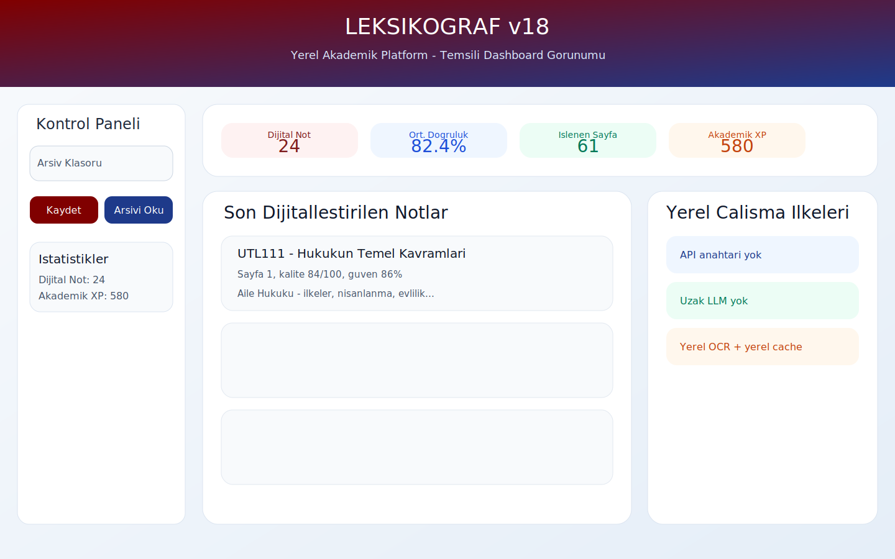
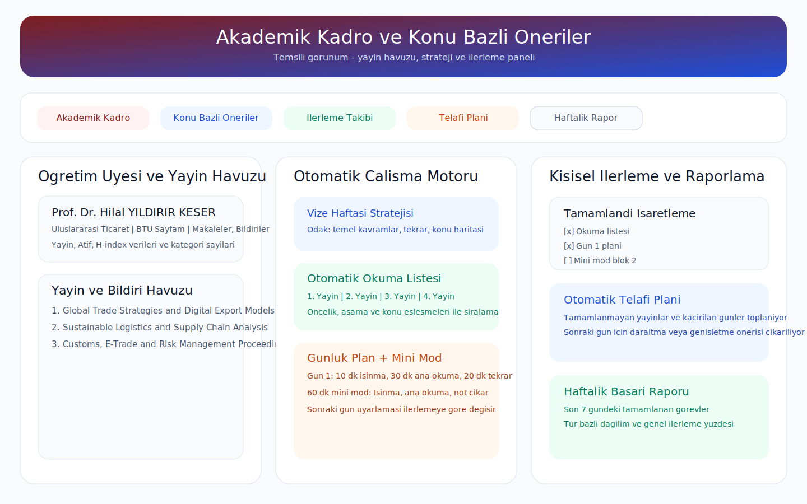

# LEKSIKOGRAF v18

LEKSIKOGRAF v18, el yazisi ders notlarini yerel olarak dijitallestiren, BTU Uluslararasi Ticaret ve Lojistik Bolumu icin resmi kaynaklardan akademik veri toplayan ve bu verileri ders-calisma asistanina donusturen Streamlit tabanli bir akademik platformdur.

Bu surumun ana farki sudur:
- API anahtari gerektirmez.
- Uzak LLM cagrisi yapmaz.
- OCR, arsivleme ve akademik analiz akisini yerel calistirir.
- BTU bolum verilerini ve akademik yayinlari resmi kaynaklardan cekip yerel onbellekte tutar.
- Ders, konu, sinav donemi ve ilerleme durumuna gore calisma plani uretir.

## Temsili Ekran Goruntuleri

Asagidaki gorseller birebir ekran kaydi degil, uygulamanin ana akisini anlatmak icin hazirlanmis temsili arayuz gorunumleridir.

### Dashboard Gorunumu



### Akademik Kadro ve Oneri Motoru



## Temel Yetenekler

### 1. Profesyonel OCR
- JPG, JPEG ve PNG not sayfalarini yukler.
- Tesseract tabanli yerel OCR uygular.
- Yerel terim duzeltmeleri ile daha okunur cikti uretir.
- Notlari JSON ve Markdown olarak arsivleyebilir.

### 2. Akademik Kutuphane
- PDF kaynaklari parcali hale getirir.
- Yerel soru uretimi yapar.
- Ders materyalinden kisa calisma parcaciklari cikarir.

### 3. BTU Akademik Kadro ve Bolum Zekasi
- BTU UTL bolum sayfalarini esas alir.
- Akademik kadro, duyurular, haberler, iletisim ve bolum ozetini gosterir.
- Ogretim uyelerinin BTU Sayfam profillerinden yayin ve bildiri havuzu olusturur.
- Canli erisim yoksa son cekilen yerel JSON onbellek verisini kullanir.

### 4. Ders ve Konu Bazli Yayin Onerileri
- Yayinlari ders basliklari ve konu terimleri ile indeksler.
- "Bu ders icin hangi yayinlar daha ilgili?" sorusuna cevap verir.
- Makale, bildiri ve diger kategorileri puanlayarak siralar.

### 5. Otomatik Calisma Planlama
- Otomatik okuma listesi uretir.
- Sinav haftasi icin oncelikli 5 yayin listesi cikarir.
- Gunluk calisma takvimi olusturur.
- 30 / 60 / 90 dakikalik mini calisma modu kurar.
- Vize Haftasi, Final Haftasi ve Son 3 Gun Panik Modu stratejileri sunar.

### 6. Kisisel Ilerleme ve Uyarlanabilir Plan
- Gorevler checkbox ile tamamlandi diye isaretlenebilir.
- Ilerleme durumu yerel JSON dosyasinda saklanir.
- Tamamlanma oranina gore sonraki gun plani otomatik daralir veya genisler.
- Tamamlanmayan konular icin telafi plani cikarir.
- Son 7 gun icin haftalik basari raporu uretir.

## Uygulama Mimarisi

### Ana Giris
- `Leksikograf_v18.py`

### Moduler Paket
- `leksikograf/config.py`
  Sistem ayarlari, varsayilan dizinler, cache yolları ve sayfa konfigurasyonu.
- `leksikograf/ocr.py`
  Yerel OCR motoru ve dijitallestirme akisi.
- `leksikograf/storage.py`
  JSON ve Markdown tabanli not arsivleme.
- `leksikograf/academic.py`
  BTU bolum verisi, akademik yayin toplama, yayin indeksleme ve strateji motoru.
- `leksikograf/progress.py`
  Kisisel ilerleme kaydi, tamamlanma takibi, telafi planlari ve haftalik raporlar.
- `leksikograf/study.py`
  PDF parcala, soru uret, yerel calisma raporlari ve yardimci akademik ozetler.
- `leksikograf/text_utils.py`
  Metin parcala ve anahtar kelime cikarma yardimcilari.

## Sekmeler

### Dashboard
- Son dijitallestirilen notlar
- Kalite metrikleri
- Oturum istatistikleri

### Profesyonel OCR
- Not gorseli yukleme
- Yerel OCR isleme
- Sonuclari kaydetme ve indirme

### Akademik Kadro
- Bolum ozeti
- Duyurular ve haberler
- Etkinlik ve iletisim
- Kadro ve yayin havuzu
- Konu bazli oneriler
- Strateji, gunluk plan, mini mod, telafi ve haftalik rapor

### Akademik Kutuphane
- PDF tabanli ders kutuphanesi
- Yerel soru uretimi

### Ders Programi
- PDF ders programi varsa ondan okur
- Yoksa yedek tabloyu kullanir

### Mufredat Arastirma
- Konu secerek yerel calisma raporu uretir

### Sistem
- Uygulama istatistikleri
- Not oturumu temizleme

## Veri Kaynaklari

Akademik veri katmani su resmi kaynaklari kullanir:
- BTU UTL ana sayfasi
- BTU UTL akademik kadro sayfasi
- BTU Sayfam akademik profilleri

Canli erisim basarisiz olursa sistem su dosyalardan calisir:
- `.cache/academic_cache.json`
- `.cache/study_progress.json`

## Yerel Dosya Yapisi

Onerilen ana dosyalar:
- `Leksikograf_v18.py`
- `requirements.txt`
- `run_local.bat`
- `README_kurulum.txt`
- `README.md`
- `leksikograf/`

Yerel calisma sirasinda olusan veriler:
- `.cache/academic_cache.json`
- `.cache/study_progress.json`
- `notes_archive/`

## Kurulum

### Gerekli Bilesenler
- Windows
- Python 3.11 veya benzeri guncel surum
- Tesseract OCR

### Paket Kurulumu
```powershell
pip install -r requirements.txt
```

### Tesseract
Sistemde Tesseract kurulu olmalidir. Uygulama OCR icin bunu kullanir.

### Baslatma
Kolay baslatma icin:
```bat
run_local.bat
```

Veya dogrudan:
```powershell
streamlit run Leksikograf_v18.py
```

## Kullanim Akisi

### Not Dijitallestirme
1. Profesyonel OCR sekmesine gidin.
2. Dersi ve ogretim uyesini secin.
3. Gorselleri yukleyin.
4. Dijitallestir butonuna basin.
5. Sonucu arsive kaydedin veya indirin.

### Akademik Yayinlarla Calisma
1. Akademik Kadro sekmesine gidin.
2. Konu Bazli Oneriler alt alanini acin.
3. Dersi, konulari ve stratejiyi secin.
4. Otomatik okuma listesini ve sinav onceliklerini inceleyin.
5. Gunluk plan ve mini calisma modunu kullanin.
6. Tamamlanan maddeleri isaretleyin.
7. Telafi plani ve haftalik raporu kontrol edin.

## Ornek Kullanim Senaryolari

### Senaryo 1: El Yazisini Temiz Nota Donusturme
- Kullanici `Profesyonel OCR` sekmesine gelir.
- Tek bir ders sayfasini yukler.
- Sistem yerel OCR calistirir ve metni daha okunur hale getirir.
- Sonuc arsive kaydedilir ve `.txt` veya `.md` olarak disari alinabilir.

### Senaryo 2: Sinav Haftasi Icin Hedefli Calisma
- Kullanici `Akademik Kadro > Konu Bazli Oneriler` alanina girer.
- Dersi ve ilgili konulari secer.
- `Vize Haftasi` veya `Final Haftasi` stratejisini isaretler.
- Sistem en ilgili yayinlari, oncelikli ilk 5 kaynagi ve gunluk plani uretir.

### Senaryo 3: Panik Modunda Hizli Toparlama
- Kullanici sinava 3 gun kala `Son 3 Gun Panik Modu`nu secer.
- Uygulama en yuksek getirili konulari ve en hizli okunabilir kaynaklari one cikarir.
- 30 veya 60 dakikalik mini modlar ile odak bloklari olusturulur.

### Senaryo 4: Kalan Konular Icin Telafi Plani
- Kullanici tamamladigi maddeleri checkbox ile isaretler.
- Sistem tamamlanma oranini hesaplar.
- Yetismeyen maddeler otomatik telafi planina tasinir.
- Haftalik raporda hangi konularin aksadigi ve ne kadar ilerleme saglandigi gorulur.

## Strateji Motoru

### Vize Haftasi
- Temel kavram odaklidir.
- Orta yogunlukta tekrar kurar.
- Kavram haritasi cikarmayi hedefler.

### Final Haftasi
- Daha uzun ve kapsamli tekrar sunar.
- Unite baglantilarini one cikarir.
- Derin okuma ve sentez odaklidir.

### Son 3 Gun Panik Modu
- En yuksek getirili konulara yuklenir.
- Kisa ve sert bloklarla hizli toparlama saglar.
- Son dakika puan kazandiracak basliklari onde tutar.

## Ilerleme Sistemi

Ilerleme takibi su mantikla calisir:
- Okuma listesi maddeleri
- Sinav haftasi oncelik maddeleri
- Gunluk plan gunleri
- Mini calisma bloklari

Tamamlanan maddeler isaretlendikce sistem:
- Tamamlanma oranini hesaplar
- Sonraki gun icin uyarlama yapar
- Tamamlanmayanlari telafi planina alir
- Son 7 gunu haftalik basari raporuna isler

## Guvenlik ve Tasarim Ilkeleri
- API key yok
- Uzak LLM yok
- Yerel OCR ve yerel cache var
- Akademik veri resmi kaynaklardan gelir
- Baglanti olmadiginda son yerel veri korunur

## Surumleme

Bu repo `CHANGELOG.md` ile surum notlarini takip eder. Ilk resmi etiket `v1.0.0`, `LEKSIKOGRAF v18` uygulamasinin API'siz, moduler ve akademik tavsiye motorlu ilk kararli yapisini temsil eder.

## Gelistirme Notlari
Bu repo icinde eski surum dosyalari bulunabilir; aktif ve onerilen surum `Leksikograf_v18.py` ve `leksikograf/` paketidir.

## Bilinen Sinirlar
- OCR kalitesi fotograf kalitesine baglidir.
- BTU web yapisi degisirse parser guncellemesi gerekebilir.
- Streamlit arayuzu icin bu ortamda her zaman gorunumsel test yapilamayabilir.

## Hedeflenen Kullanim Senaryosu
Bu sistem ozellikle su tip kullanim icin tasarlandi:
- El yazisi ders notlarini dijitallestirmek isteyen ogrenciler
- BTU UTL odakli akademik calisma yapan kullanicilar
- Ders + konu + yayin + sinav stratejisini tek yerde yonetmek isteyenler
- Yerel ve API'siz bir akademik asistan arayanlar

## Hızlı Özet
LEKSIKOGRAF v18 artik sadece OCR yapan bir arac degil.
Ayni zamanda:
- bolum zekasi katmani olan,
- resmi kaynaklardan beslenen,
- yayini derse baglayan,
- ilerlemeyi izleyen,
- telafi ve haftalik rapor ureten,
- sinav moduna gore strateji degistiren
bir yerel akademik calisma platformudur.
